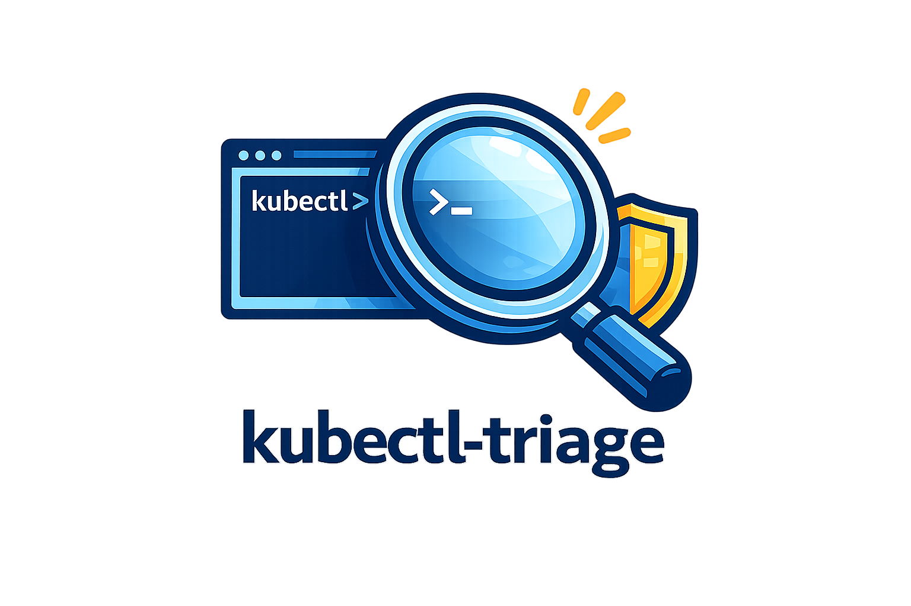

# kubectl-triage

<p align="center">
  
</p>

First-response context for suspicious Kubernetes workloads.

`kubectl-triage` is a read-only kubectl plugin that collapses the first 60 seconds of incident triage into a single command — summary first, details after.

```bash
kubectl triage pod suspicious-pod -n payments
```

```
══ kubectl-triage: payments/suspicious-pod [Pod] ══
   2026-04-05 17:00:00 UTC

▸ Summary
  - pod is not ready
  - restart loop indicators present
  - image uses :latest (app)
  - service account token is auto-mounted
  - uses default service account
  - no NetworkPolicy selects this workload
  - runAsNonRoot is not set

▸ Workload
  Name                         suspicious-pod
  Namespace                    payments
  Kind                         Pod
  Phase                        Running
  Node                         node-1
  Ready                        no
  Restarting                   yes

▸ Image
  app → docker.io/myapp:latest  ⚠ :latest

▸ Security
  privileged                   no
  runAsNonRoot                 not set
  readOnlyRootFilesystem       not set
  allowPrivilegeEscalation     not set
  added capabilities           none

▸ Service Account
  name                         default  (default SA)
  automount token              enabled

▸ Key Events
  ⚠ Warning BackOff: Back-off restarting failed container (CrashLoopBackOff)
  ⚠ Warning PolicyViolation: require-run-as-non-root

▸ Log Tail [app]
  container is restarting too quickly to return a stable log tail

▸ Network
  NetworkPolicy                ✗ none — unrestricted
                               ingress/egress may be unrestricted depending on cluster defaults

▸ RBAC
  no direct RoleBinding/ClusterRoleBinding match found for this service account in current lookup

▸ Suggested Next Checks
  - inspect container command and entrypoint — pod is restarting
  - check logs for crash cause — CrashLoopBackOff detected (14x)
  - confirm whether the workload actually needs Kubernetes API access — automount token is enabled
  - consider using a dedicated service account instead of the default one
  - review pod securityContext — runAsNonRoot is not set
  - pin image "app" to a fixed version — :latest may change unexpectedly
  - add a NetworkPolicy — ingress/egress are currently unrestricted

▸ Triage Readout
  This looks like a restart-looping pod with weak security defaults and unrestricted network scope.
```

---

## What it collects

| Section | Details |
|---------|---------|
| **Summary** | Short risk bullet list — shown first, always |
| **Workload** | Name, namespace, phase, node, ready/restarting status |
| **Image** | All containers + init containers, `:latest` flag |
| **Security** | privileged, runAsNonRoot, readOnlyRootFilesystem, allowPrivilegeEscalation, added capabilities |
| **Service Account** | Name, default SA detection, automount token status |
| **Key Events** | Top 5 events, warnings prioritised — use `--verbose` for full list |
| **Log Tail** | Last 30 lines of the primary container |
| **Network** | NetworkPolicy coverage, bound Services |
| **RBAC** | RoleBindings and ClusterRoleBindings for the service account |
| **Suggested Next Checks** | Action-oriented next steps — not compliance verdicts |
| **Triage Readout** | Single-sentence situational summary |

---

## Why it exists

When something looks suspicious, the first 3 minutes matter. Engineers typically run:

```
kubectl describe pod ...
kubectl get events ...
kubectl logs ...
kubectl get networkpolicy ...
kubectl get rolebindings ...
```

`kubectl-triage` collapses this into a single command — summary first, details after.

---

## Install

> **How kubectl plugins work:** kubectl discovers any executable on your `$PATH` whose name starts with `kubectl-`. No registration needed — copy the binary and you're done.

### Option 1 — Build from source

**Requirements:** Go 1.22+

```bash
git clone https://github.com/topcug/kubectl-triage.git
cd kubectl-triage
go build -o kubectl-triage ./main.go
cp kubectl-triage ~/.local/bin/kubectl-triage

# Verify
kubectl plugin list | grep triage
kubectl triage --help
```

### Option 2 — go install

```bash
go install github.com/topcug/kubectl-triage@latest
# Binary lands in $(go env GOPATH)/bin — make sure that's on your PATH
export PATH="$PATH:$(go env GOPATH)/bin"
```

### Option 3 — Krew _(planned v1.1)_

```bash
kubectl krew install triage
```

### Option 4 — Pre-built binary _(planned v0.2)_

Download from [GitHub Releases](https://github.com/topcug/kubectl-triage/releases), make executable, place on PATH:

```bash
# Linux amd64 example
tar -xzf kubectl-triage_linux_amd64.tar.gz
chmod +x kubectl-triage
mv kubectl-triage ~/.local/bin/
```

---

## Usage

```bash
# Triage a pod
kubectl triage pod <n> -n <namespace>

# Triage a deployment
kubectl triage deployment <n> -n <namespace>

# Triage a job
kubectl triage job <n> -n <namespace>

# Show full event list and owner chain
kubectl triage pod <n> -n <namespace> --verbose

# JSON output — pipe to jq or use in CI
kubectl triage pod <n> -n <namespace> -o json

# Markdown output — paste into incident docs, Slack, Notion
kubectl triage pod <n> -n <namespace> -o markdown

# Use a specific kubeconfig or context
kubectl triage pod <n> -n <namespace> --context staging --kubeconfig ~/.kube/other.yaml
```

### Flags

| Flag | Short | Default | Description |
|------|-------|---------|-------------|
| `--namespace` | `-n` | `default` | Namespace of the target resource |
| `--output` | `-o` | `table` | Output format: `table`, `json`, `markdown` |
| `--verbose` | `-v` | `false` | Show full event list and owner chain |
| `--context` | | current context | Kubernetes context to use |
| `--kubeconfig` | | `~/.kube/config` | Path to kubeconfig file |

---

## Required permissions

`kubectl-triage` is read-only. It needs these permissions in the target namespace:

```
pods, pods/log      — get
events              — list
deployments         — get
jobs                — get
serviceaccounts     — get
networkpolicies     — list
services            — list
rolebindings        — list
clusterrolebindings — list
clusterroles        — get
```

If a permission is missing, the affected section shows a graceful warning and the rest of the report still renders.

---

## Design principles

- **Summary first** — risk bullets and triage readout frame every output before the details.
- **Read-only** — never modifies cluster state. No `exec`, `patch`, `cordon`, or `delete`.
- **Fast** — 8-second total timeout. Partial results on permission errors.
- **Scriptable** — `-o json` produces stable, parseable output for `jq` or CI pipelines.
- **Kubernetes-native** — respects `KUBECONFIG`, `--context`, and `--namespace` like any kubectl command.
- **Action-oriented** — every recommendation tells you what to do, not just what's wrong.

---

## Development

```bash
git clone https://github.com/topcug/kubectl-triage.git
cd kubectl-triage

make test     # run tests with race detector
make build    # produces ./bin/kubectl-triage
```

After building, copy the binary to a directory on your `$PATH`:

```bash
cp bin/kubectl-triage ~/.local/bin/kubectl-triage
```

---

## Roadmap

- [x] v0.1 — pod, deployment, job triage (table / json / markdown)
- [ ] v0.2 — pre-built binaries on GitHub Releases
- [ ] v0.3 — `kubectl triage namespace <n>` for namespace-wide summary
- [ ] v1.1 — Krew index submission
- [ ] v1.2 — configurable recommendation rules via `.kubectl-triage.yaml`
- [ ] v2.0 — `--diff` mode to compare two reports over time

---

## License

Apache 2.0 — see [LICENSE](LICENSE)
